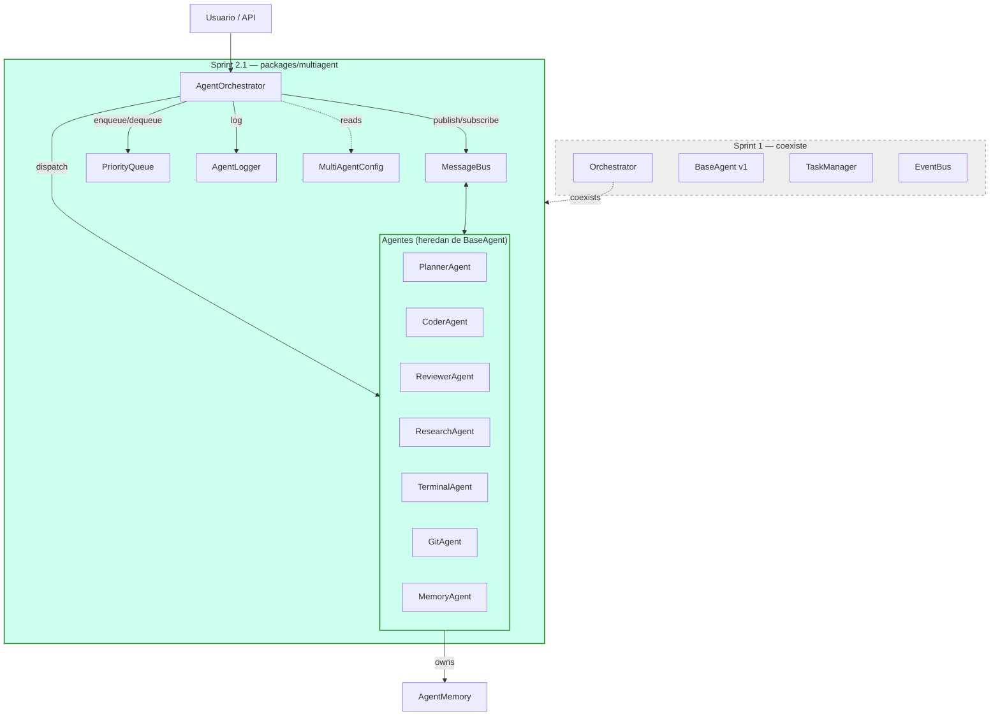
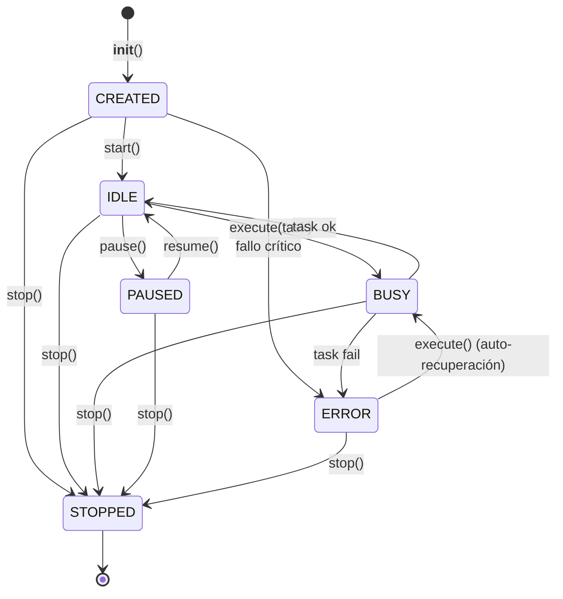
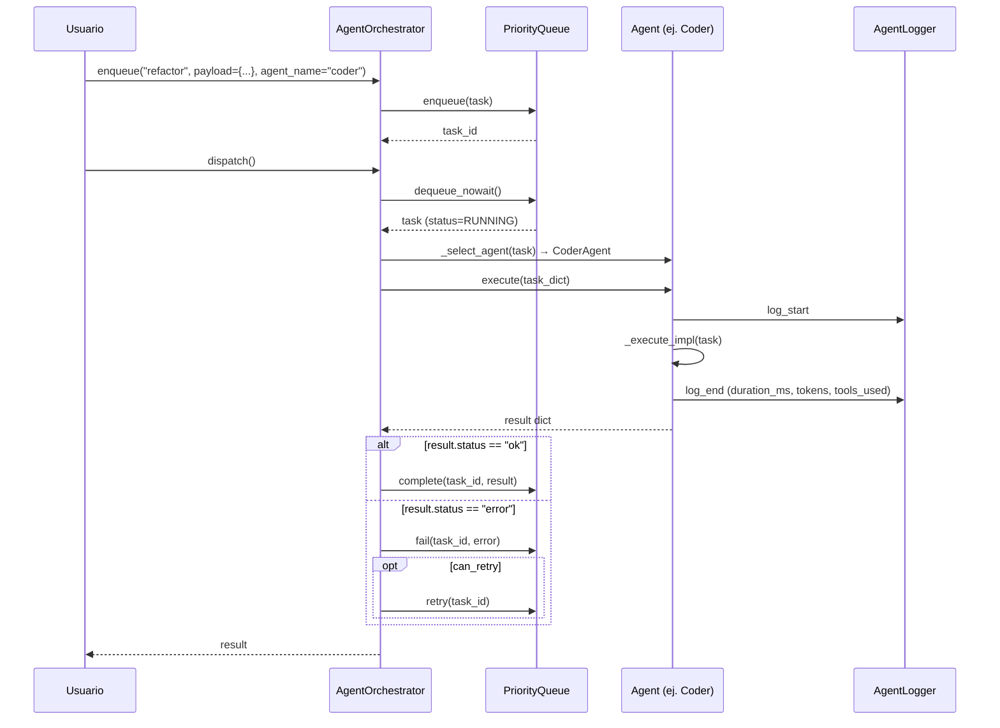
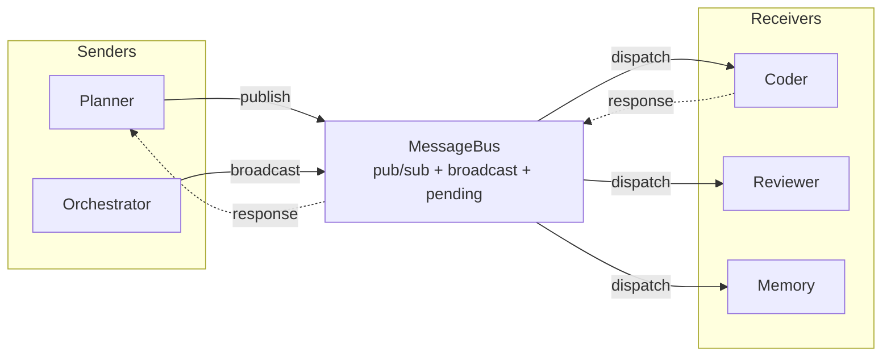
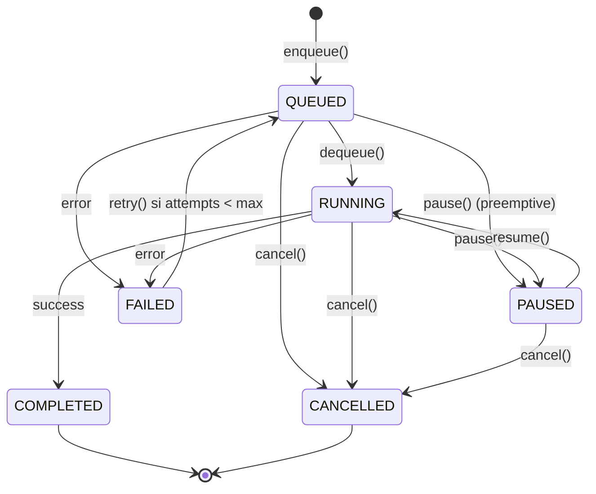

# Sprint 2.1 Multi-Agent — Diagramas

## 1. Arquitectura general



## 2. Lifecycle de un agente



## 3. Flujo de dispatch



## 4. Mensajería entre agentes



## 5. Cola prioritaria de tareas



## 6. Health check

```mermaid
flowchart TD
    H[health\(\)] --> S{agent.status}
    S -->|STOPPED| DEAD[DEAD]
    S -->|ERROR| ERR[ERROR]
    S -->|BUSY| BUSY[BUSY]
    S -->|PAUSED| IDLE[IDLE]
    S -->|IDLE| ALIVE[ALIVE]
    S -->|CREATED| ALIVE
    H --> R[HealthReport]
    R --> RPT[agent, state, status,<br/>uptime, tasks_ok/failed,<br/>last_error, memory_kb, metadata]
```
