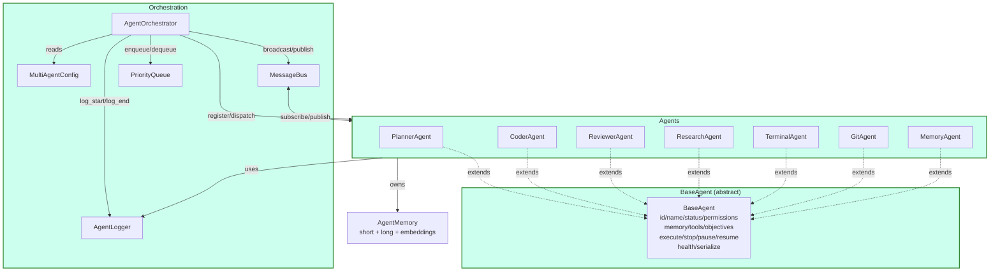

# Sprint 2.1 — Multi-Agent Orchestrator

> **Estado:** ✅ Completo · **Rama:** `feature/sprint-2-1-multi-agent`
> **Tests:** 115 unitarios pasando · **Sprint 1 compat:** ✅ sin rupturas

## Resumen

Implementación de una **arquitectura profesional basada en agentes**
para Liz Coder Plus. Cada agente expone identidad, estado, permisos,
memoria, herramientas y objetivos, administrados por un
`AgentOrchestrator` central con cola prioritaria, mensajería async,
logs estructurados, health checks y métricas.

La arquitectura convive con el `Orchestrator` y `BaseAgent` heredados
de Sprint 1 — no se reemplaza código existente, se añade una nueva
capa en `packages/multiagent/` lista para integrarse mediante
adaptadores.

## Diagrama de arquitectura



## Componentes

### `BaseAgent` (abstracta)

Identidad y lifecycle de un agente.

| Atributo / Método | Tipo | Descripción |
|---|---|---|
| `id` | `str` | UUID4 generado automáticamente |
| `name` | `str` | Nombre único del agente |
| `description` | `str` | Descripción humana |
| `status` | `AgentStatus` | CREATED/IDLE/BUSY/PAUSED/ERROR/STOPPED |
| `permissions` | `frozenset[Permission]` | Permisos declarados |
| `memory` | `AgentMemory` | Memoria corta + larga + embeddings |
| `tools` | `list[str]` | Herramientas declaradas |
| `objectives` | `list[str]` | Objetivos (para routing por kind) |
| `execute(task)` | `async` | Ejecuta una tarea con timeout + lifecycle |
| `stop()` | `async` | Detiene al agente |
| `pause()` / `resume()` | `async` | Pausa/reanuda |
| `health()` | `HealthReport` | alive/busy/idle/error/dead + métricas |
| `serialize()` | `dict` | Snapshot completo serializable |

### `AgentOrchestrator`

Orquestador central.

| Método | Descripción |
|---|---|
| `register_agent(agent)` | Registra y arranca un agente (respeta `max_agents`) |
| `remove_agent(name)` | Detiene y elimina un agente |
| `get_agent(name)` | Lookup por nombre |
| `enqueue(name, payload, ...)` | Crea y encola una `Task` |
| `dispatch(task=None)` | Saca de cola y despacha al agente adecuado |
| `run_until_empty()` | Bucle de dispatch hasta vaciar |
| `broadcast(payload)` | Mensaje a todos los agentes |
| `send_to(receiver, type, payload)` | Mensaje directo |
| `pause_all()` / `resume_all()` | Control global |
| `stop_all()` | Detiene todos los agentes |
| `health()` | Health de todos los agentes + resumen |
| `metrics()` | Métricas agregadas |
| `start_heartbeat()` / `stop_heartbeat()` | Background health check periódico |
| `shutdown()` | Apagado ordenado |

### `MessageBus` y `Message`

Sistema pub/sub async entre agentes.

- **Message**: id, timestamp, sender, receiver (`*` = broadcast),
  type (REQUEST/RESPONSE/EVENT/ERROR/SYSTEM), priority, payload,
  correlation_id, ttl.
- **MessageBus**: `subscribe`, `subscribe_broadcast`, `publish`,
  `dispatch_pending`, `unsubscribe`, `stats`.
- Aislamiento de errores: si un handler falla, los demás reciben el
  mensaje igual.

### `PriorityQueue` y `Task`

Cola prioritaria async-safe.

- **Task**: id, name, priority, status, agent_name, payload, attempts,
  max_attempts, result, error, timestamps.
- **Estados**: queued → running → completed/failed/cancelled,
  running ⇄ paused, failed → queued (retry).
- **Orden**: priority_weight (critical=0 < high=1 < normal=2 < low=3),
  desempate por `created_at` (FIFO).

### `AgentMemory`

Memoria por agente.

- **Corta**: `deque` circular (default 64 entradas).
- **Larga**: dict LRU (default 1024 entradas) con `store`/`retrieve`/`forget`.
- **Embeddings**: lista con `add_embedding` y `search_similar`
  (cosine similarity, sin numpy).

### `AgentLogger`

Logs estructurados en ring buffer (default 500 entradas).

- Fases: `start`, `end`, `error`, `tool`, `metric`.
- Métricas: duration_ms, memory_kb (RSS), tokens_prompt,
  tokens_completion, tools_used.
- Consultas: `history`, `by_agent`, `by_task`, `errors`, `stats`.

### `MultiAgentConfig`

Configuración inmutable (frozen dataclass).

| Parámetro | Default | Descripción |
|---|---|---|
| `max_agents` | 32 | Máximo de agentes registrados |
| `default_timeout` | 60s | Timeout de pausa en `execute` |
| `task_timeout` | 120s | Timeout de ejecución de `_execute_impl` |
| `heartbeat_interval` | 5s | Intervalo del heartbeat |
| `queue_max_size` | 1000 | Capacidad de la cola |
| `log_history_size` | 500 | Entradas en ring buffer |
| `memory_short_capacity` | 64 | Memoria corta |
| `memory_long_capacity` | 1024 | Memoria larga (LRU) |
| `retry.max_attempts` | 3 | Reintentos |
| `retry.backoff_base` | 0.5s | Backoff exponencial base |
| `retry.backoff_cap` | 30s | Tope del backoff |
| `enable_heartbeat` | True | Arrancar heartbeat automáticamente |

## Agentes concretos

| Agente | Permisos | Objetivos | Acciones |
|---|---|---|---|
| `PlannerAgent` | MEMORY_READ/WRITE | plan, decompose, estimate, prioritize | Divide por patrones (file_op/terminal/research/system), estima dificultad, persiste plan |
| `CoderAgent` | READ_FILES, WRITE_FILES, MEMORY_WRITE | code, refactor, fix, test, implement | write (con permiso), refactor (normaliza), fix (marca líneas), test (genera esqueleto pytest) |
| `ReviewerAgent` | READ_FILES, MEMORY_WRITE | review, audit, security, performance, quality | Detecta eval/exec/os.system/shell=True, bare except, print, líneas largas, loops anidados, fns sin docstring |
| `ResearchAgent` | NETWORK_ACCESS, MEMORY_READ/WRITE | research, investigate, summarize, search | Fetch HTTP best-effort, extract_topic, build_summary estructurado |
| `TerminalAgent` | EXECUTE_COMMANDS, MEMORY_WRITE | execute, process, monitor, shell | Allowlist + bloqueo de `&&;\|>$()` salvo `allow_shell=True` + UNRESTRICTED |
| `GitAgent` | GIT_OPERATIONS, EXECUTE_COMMANDS, MEMORY_WRITE | git, commit, branch, merge, push | status/diff/log/add/commit/branch/checkout/merge/push/pull; force push requiere UNRESTRICTED |
| `MemoryAgent` | MEMORY_READ/WRITE | memory, store, retrieve, embed, search | store/retrieve/forget/add_embedding/search/recent/clear/keys |

## Health states

Cada agente devuelve un `HealthReport` con `state`:

- `ALIVE` — activo y disponiendo (IDLE no pausado)
- `BUSY` — ejecutando una tarea
- `IDLE` — pausado (no acepta nuevas)
- `ERROR` — en estado de error (auto-recuperable en próximo execute)
- `DEAD` — detenido (terminal)

## Comunicación entre agentes

```python
# Planner envía request a Coder
msg = await planner.send_message(
    receiver="coder",
    type_=MessageType.REQUEST,
    payload={"task": "implement_feature_x"},
    priority=Priority.HIGH,
)

# Coder responde (correlation_id empareja REQUEST/RESPONSE)
reply = await coder.send_message(
    receiver="planner",
    type_=MessageType.RESPONSE,
    payload={"status": "ok", "files": [...]},
    correlation_id=msg.id,
)
```

## Compatibilidad con Sprint 1

| Componente Sprint 1 | Componente Sprint 2.1 | Estado |
|---|---|---|
| `packages/agents/src/base.py` (BaseAgent) | `packages/multiagent/src/multiagent/base.py` | Coexisten |
| `packages/core/src/orchestrator.py` (Orchestrator) | `packages/multiagent/src/multiagent/orchestrator.py` | Coexisten |
| `packages/core/src/task.py` (Task, TaskManager) | `packages/multiagent/src/multiagent/queue.py` (Task, PriorityQueue) | Coexisten |
| `packages/core/src/event_bus.py` (EventBus) | `packages/multiagent/src/multiagent/messages.py` (MessageBus) | Coexisten |

Los 43 tests de Sprint 1 verificados siguen pasando sin cambios.

## Roadmap

- **Sprint 2.2**: Adaptador bidireccional `Sprint1Adapter` para que
  los agentes de Sprint 2.1 se registren también en el `Orchestrator`
  clásico de Sprint 1.
- **Sprint 2.3**: Integrar `MemoryAgent` con el `MemoryManager` de
  `packages/memory` para persistencia SQLite.
- **Sprint 2.4**: Reemplazar la heurística de `PlannerAgent` por
  el `Planner` de `packages/core/src/planner.py` o por un LLM-backed.
- **Sprint 2.5**: Integrar `GitAgent` y `TerminalAgent` con el
  `ToolExecutor` y el `PermissionService` de Sprint 1.
