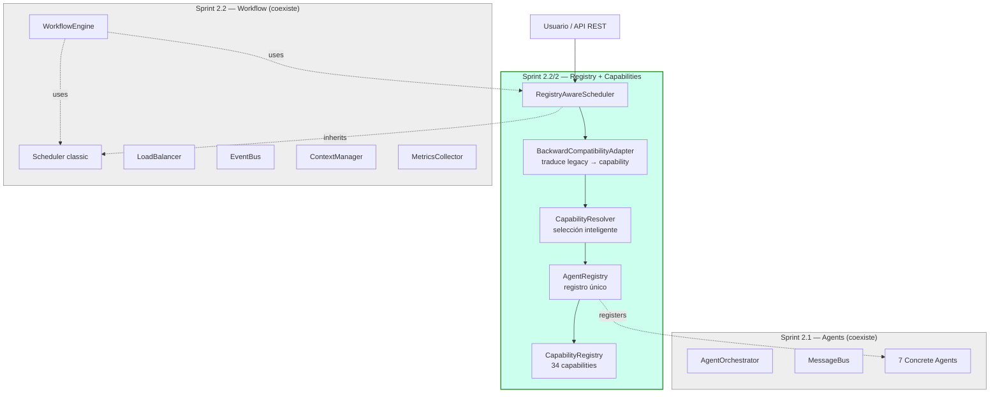
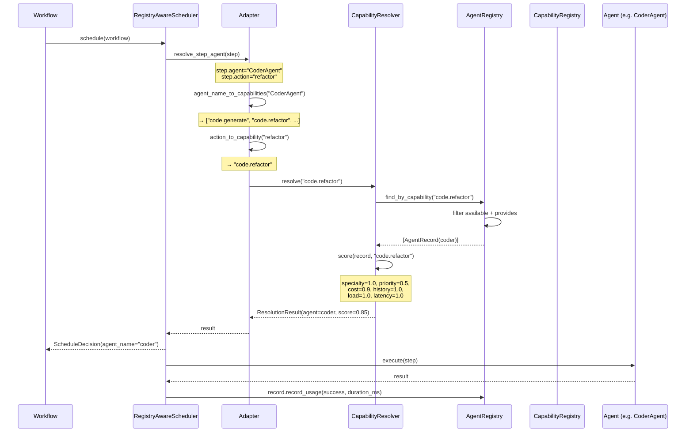
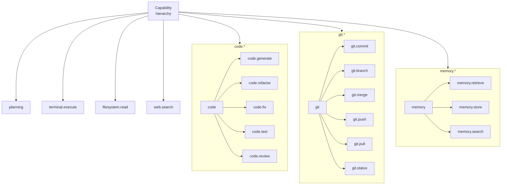
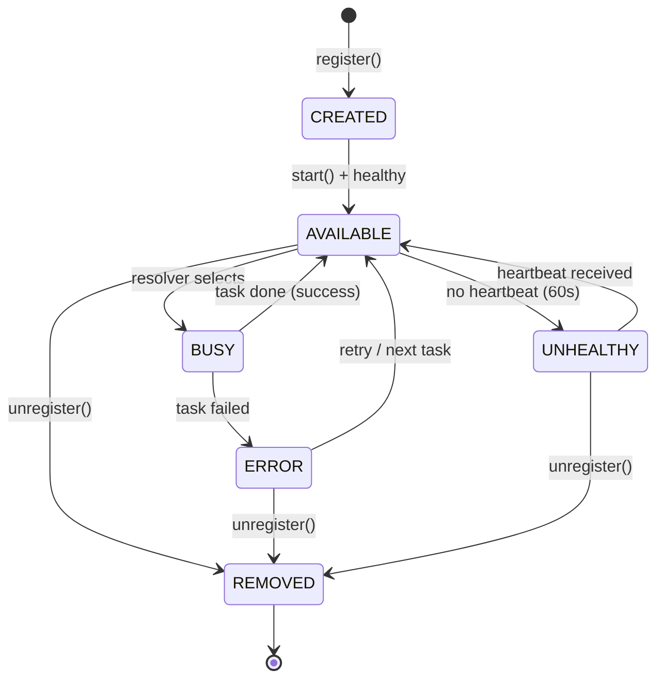
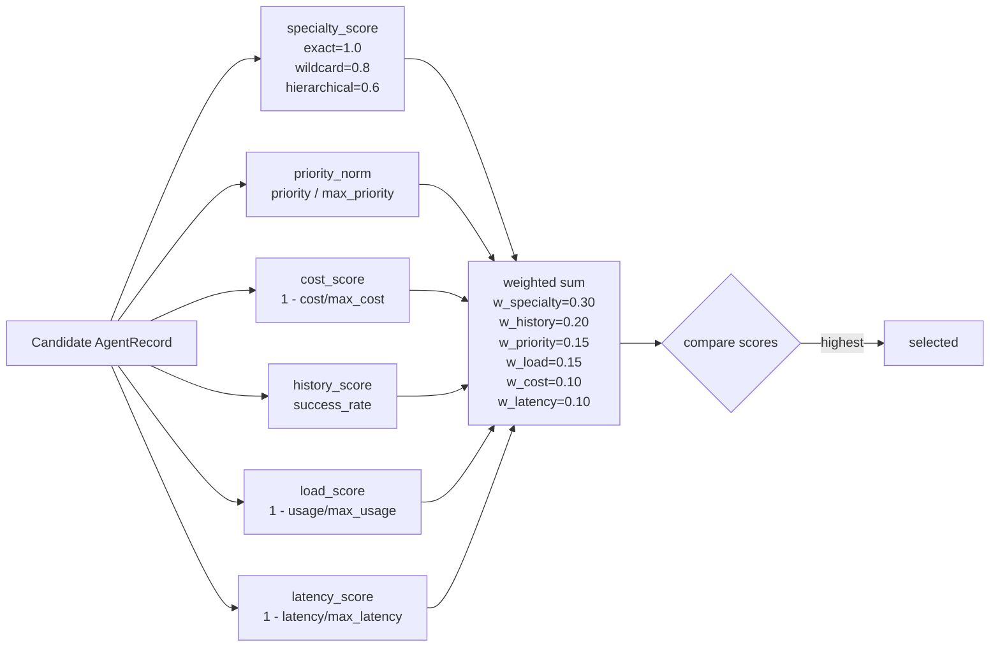
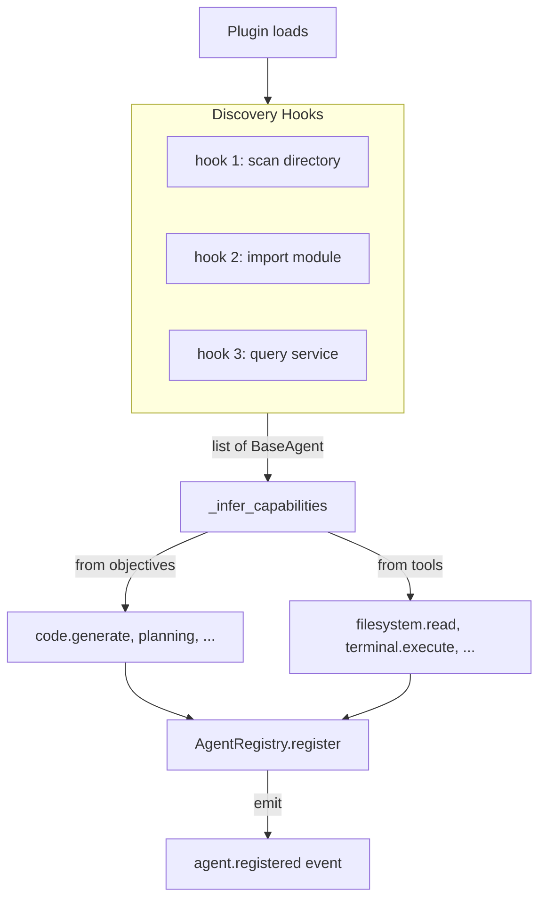
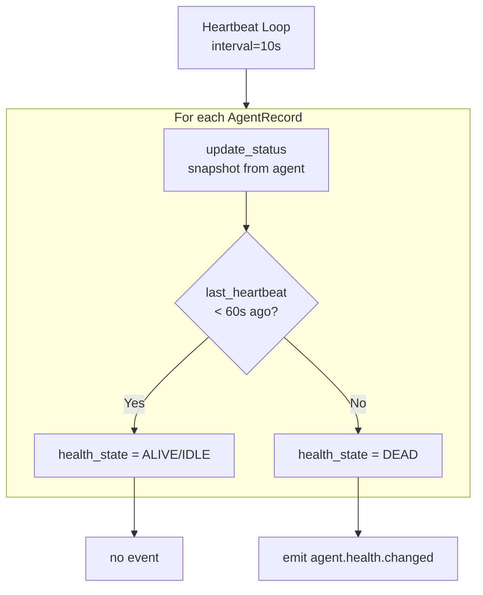

# Sprint 2.2/2 — Diagramas

## 1. Arquitectura general



## 2. Flujo: Workflow → Scheduler → Resolver → Registry → Agent



## 3. Capability hierarchy



## 4. AgentRecord lifecycle



## 5. Scoring algorithm



## 6. Auto-discovery flow



## 7. Backward compatibility

```mermaid
flowchart LR
    subgraph LEGACY["Legacy Workflow (Sprint 2.1/2.2)"]
        STEP1[step.agent = "PlannerAgent"]
        STEP2[step.agent = "CoderAgent"]
        STEP3[step.action = "refactor"]
    end

    ADAPT[BackwardCompatibilityAdapter]

    subgraph NEW["New System (Sprint 2.2/2)"]
        CAP1[planning, workflow.create]
        CAP2[code.generate, code.refactor, ...]
        CAP3[code.refactor]
        RESOLV[CapabilityResolver]
        REG[AgentRegistry]
        AGENT[any agent that<br/>provides the capability]
    end

    STEP1 --> ADAPT
    STEP2 --> ADAPT
    STEP3 --> ADAPT
    ADAPT --> CAP1
    ADAPT --> CAP2
    ADAPT --> CAP3
    CAP1 --> RESOLV
    CAP2 --> RESOLV
    CAP3 --> RESOLV
    RESOLV --> REG
    REG --> AGENT
```

## 8. Health monitoring


