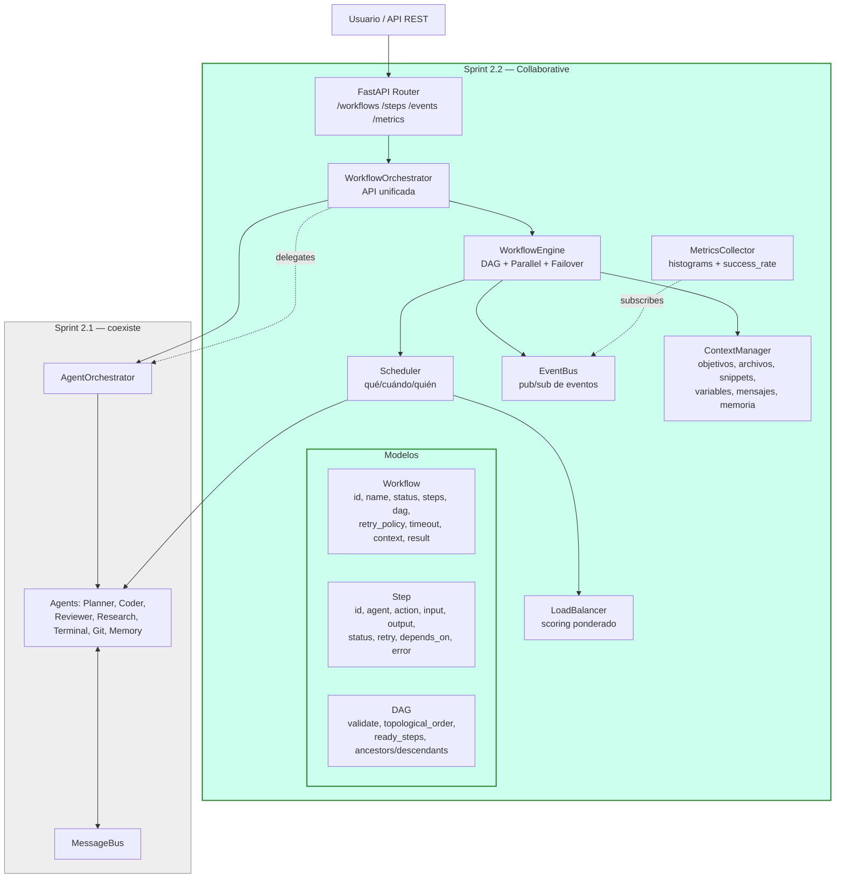

# Sprint 2.2 — Collaborative Multi-Agent Execution

> **Estado:** ✅ Completo · **Rama:** `feature/sprint-2-2-collaborative-agents`
> **Tests:** 228 pasando (130 Sprint 2.1 + 98 Sprint 2.2) · **Sprint 1 compat:** ✅

## Resumen

Transformación de los agentes en un **equipo colaborativo**. El
`WorkflowOrchestrator` coordina workflows completos entre varios
agentes, con:

- **Workflow Engine** con DAG de dependencias.
- **Step Engine** con lifecycle (PENDING → READY → RUNNING → COMPLETED/FAILED/SKIPPED).
- **DAG validation**: detecta ciclos, dependencias rotas, pasos huérfanos.
- **Parallel execution**: hasta `max_parallel_steps` y `max_parallel_agents` simultáneos.
- **Failover**: retry, reassign, skip (opcional), cancel (required).
- **Context Manager**: comparte objetivos, archivos, snippets, variables, mensajes, memoria.
- **EventBus** separado del MessageBus (pub/sub de eventos del sistema).
- **Scheduler inteligente** con **LoadBalancer** (estado, CPU, RAM, cola, especialidad, historial).
- **Observabilidad**: workflow_duration, step_duration, parallelism, queue_time, agent_usage, retry_count, success_rate (con p50/p95/p99).
- **API REST** con endpoints `/workflows`, `/workflows/{id}`, `/steps`, `/events`, `/metrics/workflows`.
- **PlannerAgent extendido**: genera workflows completos con DAG + estimaciones de tokens/tiempo/parallelismo.

## Diagrama de arquitectura



## Componentes

### `Workflow` y `Step`

Modelos de datos con todos los campos de la especificación:

**Workflow**: id, name, description, status, priority, created_at, updated_at,
owner, steps, dependencies (DAG), retry_policy, timeout, context, metadata, result.

**Step**: id, agent, action, input, output, status, retry, timeout, depends_on,
started_at, finished_at, error, criticality, tokens_prompt, tokens_completion,
duration_ms, tools_used, files_modified, warnings.

### `DAG`

Grafo acíclico dirigido con:

- `validate()`: detecta **ciclos** (DFS 3 colores), **dependencias rotas** y **pasos huérfanos**.
- `topological_order()`: Kahn's algorithm con desempate por prioridad.
- `ready_steps(completed)`: steps cuyas dependencias están completas.
- `ancestors()` / `descendants()` / `has_path()` / `subgraph()`.

### `EventBus` (separado del `MessageBus`)

Bus **pub/sub de eventos del sistema**. Mientras `MessageBus` es
punto-a-punto entre agentes, `EventBus` es broadcasting de telemetría.

**Eventos canónicos** (`WorkflowEvent`):

| Categoría | Eventos |
|---|---|
| Workflow | `workflow.created`, `workflow.started`, `workflow.paused`, `workflow.resumed`, `workflow.completed`, `workflow.failed`, `workflow.cancelled` |
| Step | `step.ready`, `step.started`, `step.finished`, `step.failed`, `step.skipped`, `step.retry`, `step.cancelled` |
| Agent | `agent.busy`, `agent.idle`, `agent.reassigned` |
| Memory/Tool | `memory.updated`, `tool.executed` |
| Context | `context.shared`, `context.transferred` |
| Observability | `metric.recorded` |

Características: historial configurable, métricas (publicados/entregados/errores
por tipo), filtros, aislamiento de errores.

### `ContextManager`

Contexto compartido entre agentes de un workflow:

| Tipo | Métodos |
|---|---|
| Objetivos | `add_objective`, `remove_objective`, `objectives` |
| Archivos | `register_file` (con SHA-256), `get_file`, `files` |
| Snippets | `add_snippet` (con tags, shareable), `get_snippet`, `snippets` |
| Variables | `set_variable`, `get_variable`, `remove_variable`, `variables` |
| Mensajes | `add_message`, `messages` |
| Memoria | `share_memory`, `get_shared_memory`, `all_shared_memory` |
| Transfer | `transfer_context(from, to)` con flags de inclusión |

### `Scheduler`

Decide **qué step**, **qué agente** y **cuándo**:

- Respeta `max_parallel_steps` y `max_parallel_agents`.
- Si `step.agent` está seteado y disponible, lo respeta.
- Si `step.agent` está excluido (falló antes), usa el LoadBalancer.
- Emite eventos `agent.busy` / `agent.idle`.

### `LoadBalancer`

Scoring ponderado (pesos normalizables):

```
score = w_state   * state_score      (0..1)
      + w_cpu     * (1 - cpu%)        (0..1)
      + w_ram     * (1 - ram_norm)    (0..1)
      + w_queue   * (1 - queue_norm)  (0..1)
      + w_specialty * specialty_match (0..1)
      + w_history * success_rate      (0..1)
```

Pesos por defecto: state=0.30, cpu=0.10, ram=0.10, queue=0.20, specialty=0.20, history=0.10.

Mantiene historial de ejecuciones por `(agent, action)` para `success_rate`
y `avg_duration_ms` (rolling window de 100).

### `WorkflowEngine`

Motor que ejecuta workflows:

- **Parallel execution**: lanza steps en paralelo con `asyncio.create_task`.
- **Failover**: retry → reassign → skip (optional) → cancel (required).
- **Propagación de SKIP**: si un step se SKIP, sus dependientes también.
- **Reset de agentes**: tras un failover, resetea el agente a IDLE.
- **Métricas por workflow**: duration_ms, parallelism_max, retry_count, reassign_count.
- **Eventos**: emite eventos en cada transición de estado.

### `FailoverPolicy`

```python
@dataclass
class FailoverPolicy:
    max_retries: int = 2
    reassign_on_fail: bool = True
    max_reassigns: int = 2
    skip_optional_on_fail: bool = True
    cancel_on_required_fail: bool = True
```

Orden de acciones:

1. RETRY si `step.retry < max_retries`.
2. REASSIGN si `reassign_on_fail` y `len(agent_reassigned) < max_reassigns`.
3. SKIP si `criticality == OPTIONAL` y `skip_optional_on_fail`.
4. CANCEL si `criticality == REQUIRED` y `cancel_on_required_fail`.
5. NONE (propagar fallo).

### `MetricsCollector`

Se suscribe al `EventBus` y construye métricas pasivamente:

| Métrica | Tipo | Descripción |
|---|---|---|
| `workflow_duration` | Histogram | Por nombre de workflow (ms) |
| `step_duration` | Histogram | Por action de step (ms) |
| `queue_time` | Histogram | Tiempo en READY antes de RUNNING (ms) |
| `parallelism` | Stats | Max y mean por workflow |
| `agent_usage` | Counter | Tiempo total ocupado por agente (ms) |
| `retry_count` | Counter | Reintentos totales |
| `success_rate` | Ratio | Por workflow, por agente, por step_action |

Los histograms exponen `count`, `mean`, `min`, `max`, `p50`, `p95`, `p99`.

### `PlannerAgent` extendido

Con `payload['op'] = 'plan_workflow'`, genera un `Workflow` completo:

```python
result = await planner.execute({
    "id": "t1",
    "name": "plan",
    "payload": {
        "op": "plan_workflow",
        "request": "lee el archivo config.json y resume su contenido",
    },
})
# result["workflow"] es un dict serializable del Workflow
# result["plan"]["strategy"] == "file_op"
# result["plan"]["estimates"] == {
#     "total_tokens": 2600,
#     "total_duration_ms_sequential": 300.0,
#     "estimated_duration_ms_parallel": 300.0,
#     "parallelism_factor": 1.0,
#     "step_count": 3,
# }
```

Patrones detectados: `file_op`, `terminal`, `research`, `system`, `review`.

### `WorkflowOrchestrator`

API unificada que combina `AgentOrchestrator` (Sprint 2.1) + `WorkflowEngine` (Sprint 2.2):

| Método | Descripción |
|---|---|
| `register_agent(agent)` | Registra en ambos |
| `submit_workflow(wf)` | Registra sin ejecutar |
| `run_workflow(wf)` | Ejecuta hasta terminar |
| `cancel_workflow(id)` | Cancela |
| `pause_workflow(id)` / `resume_workflow(id)` | Pausa/reanuda |
| `delegate(from, to, task)` | Delega tarea entre agentes |
| `request_help(from, topic)` | Broadcast de ayuda |
| `transfer_context(wf, from, to)` | Transfiere contexto |
| `wait_for(wf, step_id, timeout)` | Espera a que un step termine |
| `metrics()` / `health()` | Métricas y salud combinadas |
| `workflow_events(wf_id)` | Eventos de un workflow |

### API REST (FastAPI)

| Endpoint | Método | Descripción |
|---|---|---|
| `/workflows` | GET | Lista workflows (con filtro por status) |
| `/workflows` | POST | Crea y ejecuta en background |
| `/workflows/{id}` | GET | Detalle de un workflow |
| `/workflows/{id}/steps` | GET | Steps de un workflow |
| `/workflows/{id}/cancel` | POST | Cancela |
| `/workflows/{id}/pause` | POST | Pausa |
| `/workflows/{id}/resume` | POST | Reanuda |
| `/workflows/{id}/events` | GET | Eventos del workflow |
| `/workflows/{id}/metrics` | GET | Métricas del workflow |
| `/steps` | GET | Lista todos los steps (con filtros) |
| `/events` | GET | Eventos recientes del bus |
| `/metrics/workflows` | GET | Métricas agregadas |
| `/metrics/agents` | GET | Métricas de agentes |

## Compatibilidad

| Sprint 2.1 | Sprint 2.2 | Relación |
|---|---|---|
| `AgentOrchestrator` | `WorkflowOrchestrator` (envuelve al anterior) | Compatibles |
| `MessageBus` | `EventBus` (separado) | Coexisten |
| `PriorityQueue` / `Task` | `PriorityQueue` (workflow) / `Step` | Coexisten |
| `BaseAgent` | `BaseAgent` (sin cambios) | 100% compatible |
| 7 agentes concretos | `PlannerAgent` extendido (op=plan_workflow) | 100% compatible |

Los **130 tests de Sprint 2.1** siguen pasando sin cambios.

## Bugs encontrados y corregidos

| Bug | Solución |
|---|---|
| `Workflow.ready_steps()` excluía steps en READY, impidiendo retries | Incluir READY como estado despachable |
| `BaseAgent.execute()` deja al agente en ERROR tras un fallo, bloqueando retries | Engine resetea el agente a IDLE tras failover retry/reassign |
| Skip de un step no propagaba a dependientes | `_propagate_skip()` recursivo |
| Scheduler ignoraba `step.agent` explícito | Respetarlo si está disponible; si está excluido, usar LoadBalancer |
| `EventBus.type_str` fallaba con re-imports del enum en tests | Usar `hasattr(type, 'value')` en lugar de `isinstance` |
| Transición `FAILED → SKIPPED` no permitida | Añadida al mapa de transiciones |

## Roadmap

- **Sprint 2.3**: Integrar `MemoryAgent` (Sprint 2.1) con `ContextManager` (Sprint 2.2)
  para persistencia SQLite del contexto compartido.
- **Sprint 2.4**: Reemplazar la heurística de `PlannerAgent` por el motor LLM
  de Sprint 1.9 para generar workflows más sofisticados.
- **Sprint 2.5**: WebSocket streaming de eventos del `EventBus` al frontend
  WinUI 3 para visualización en tiempo real.
- **Sprint 2.6**: Persistencia de workflows en `TaskRepository` (Sprint 1.8)
  para recovery tras crash.
