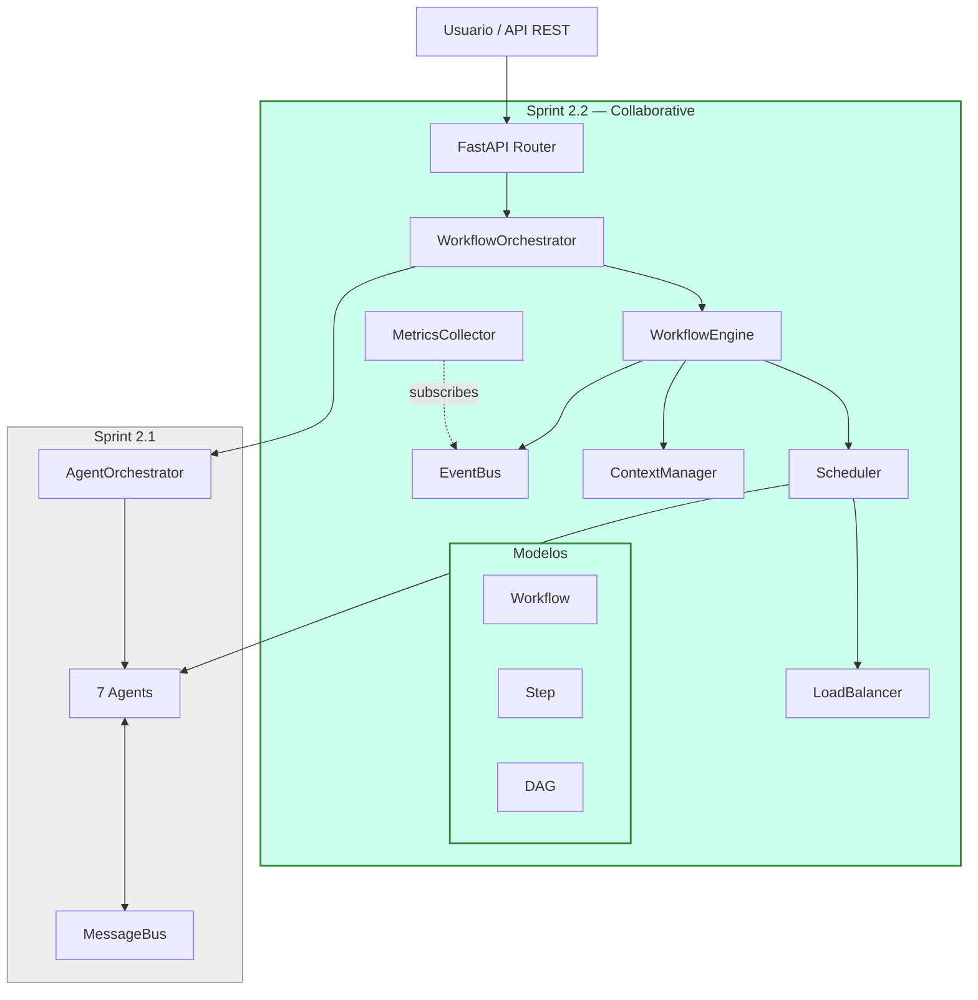
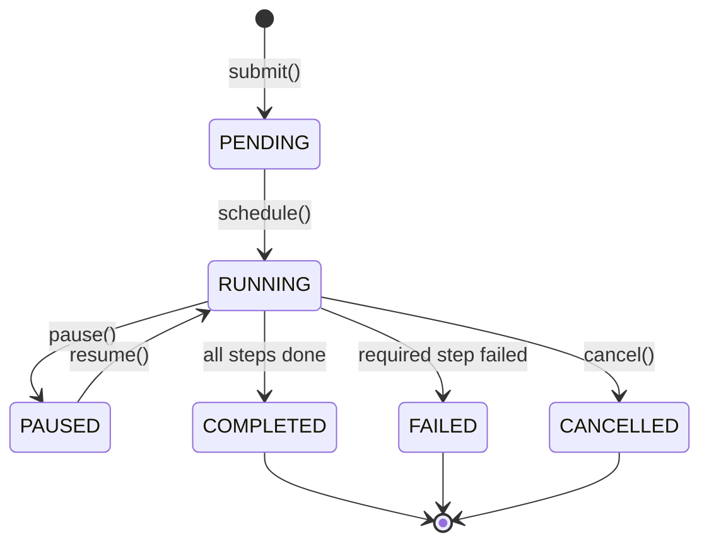
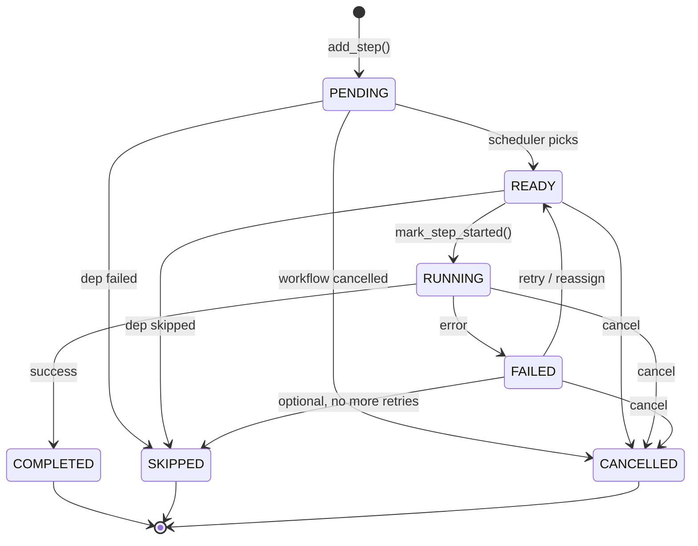
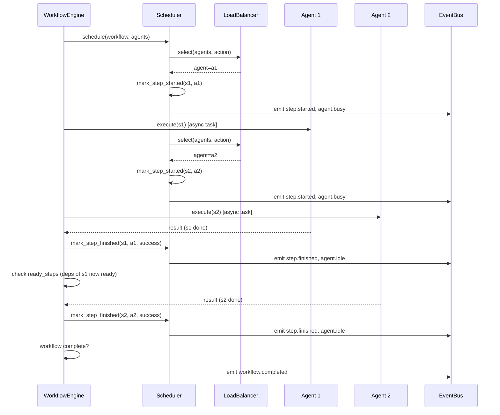
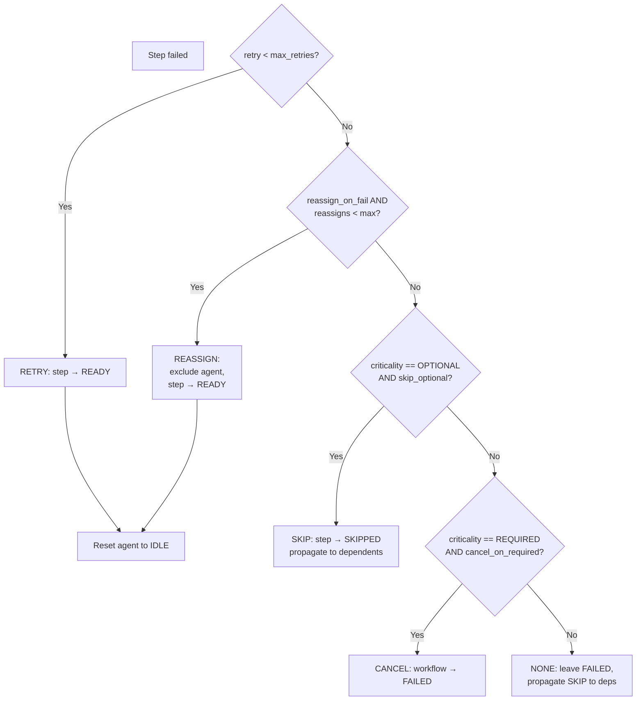
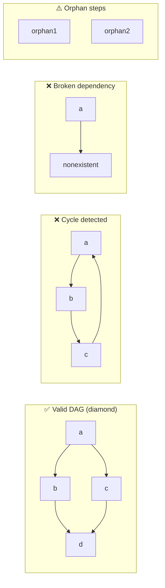
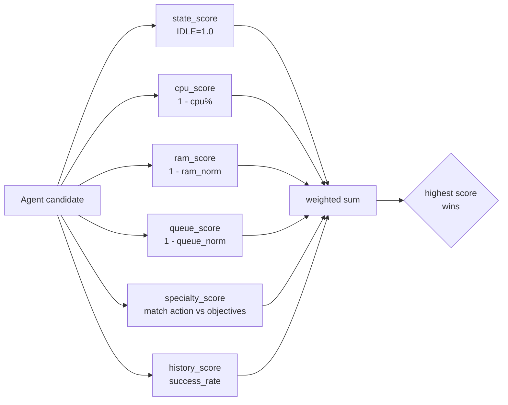
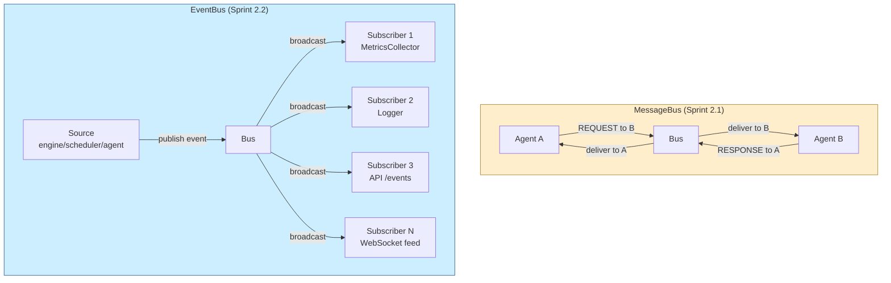
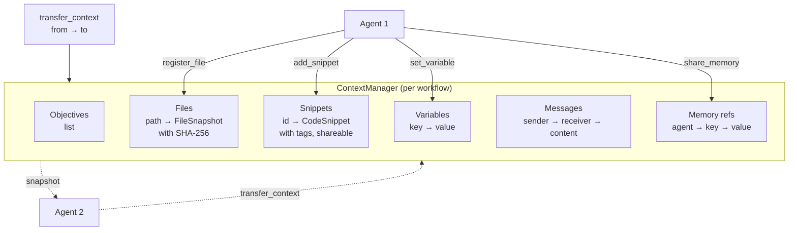

# Sprint 2.2 — Diagramas

## 1. Arquitectura general



## 2. Lifecycle de un Workflow



## 3. Lifecycle de un Step



## 4. Flujo de ejecución paralela



## 5. Failover decision tree



## 6. DAG validation



## 7. LoadBalancer scoring



## 8. EventBus vs MessageBus



## 9. Context Manager



## 10. API REST endpoints

```mermaid
flowchart LR
    CLIENT[Client]

    subgraph API["FastAPI"]
        GW[/workflows<br/>GET, POST/]
        GWID[/workflows/{id}<br/>GET/]
        GWST[/workflows/{id}/steps<br/>GET/]
        GWCTL[/workflows/{id}/cancel<br/>pause, resume<br/>POST/]
        GWEV[/workflows/{id}/events<br/>GET/]
        GWM[/workflows/{id}/metrics<br/>GET/]
        ST[/steps<br/>GET/]
        EV[/events<br/>GET/]
        MW[/metrics/workflows<br/>GET/]
        MA[/metrics/agents<br/>GET/]
    end

    WFO[WorkflowOrchestrator]

    CLIENT --> GW
    CLIENT --> GWID
    CLIENT --> GWST
    CLIENT --> GWCTL
    CLIENT --> GWEV
    CLIENT --> GWM
    CLIENT --> ST
    CLIENT --> EV
    CLIENT --> MW
    CLIENT --> MA

    GW --> WFO
    GWID --> WFO
    GWST --> WFO
    GWCTL --> WFO
    GWEV --> WFO
    GWM --> WFO
    ST --> WFO
    EV --> WFO
    MW --> WFO
    MA --> WFO
```
