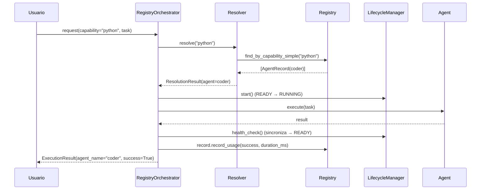
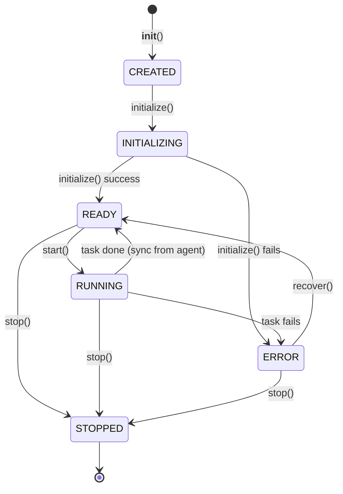

# Sprint 2.3 — Agent Lifecycle & Registry Integration

> **Estado:** ✅ Completo · **Rama:** `sprint-2.3-agent-lifecycle`
> **Tests:** 434 pasando (334 Sprint 2.1+2.2 + 100 nuevos) · **Compat:** ✅

## Resumen

Convierte el sistema de agentes en una arquitectura profesional con:

- **Agent Registry robusto** con validaciones (IDs únicos, no duplicados, registros inválidos rechazados).
- **AgentManifest** como contrato común declarativo (id/name/version/description/capabilities/priority).
- **Ciclo de vida profesional** con estados CREATED → INITIALIZING → READY ⇄ RUNNING → STOPPED, con ERROR recuperable.
- **Descubrimiento por capacidades** — el orchestrator pide "un agente con capability X", no "CoderAgent".
- **Integración limpia con Orchestrator** vía `RegistryOrchestrator` desacoplado.

## Componentes nuevos

### `AgentManifest` (`registry/manifest.py`)

Contrato declarativo inmutable. Ejemplo:

```python
manifest = AgentManifest(
    id="coder",
    name="Coder Agent",
    version="1.0.0",
    description="Writes, refactors and tests code",
    capabilities=["code.generate", "code.refactor", "python", "typescript"],
    priority=10,
)
```

**Validaciones**:
- `id`: lowercase, sin espacios, empieza con letra.
- `version`: semver (MAJOR.MINOR.PATCH).
- `name`: no vacío.
- `capabilities`: lista de strings no vacíos, sin duplicados.
- `priority`: int >= 0.

**Métodos**: `has_capability` (con wildcard `code.*` y jerárquico `code` → `code.generate`),
`has_any_capability`, `has_all_capabilities`, `matches` (patrones con `*`),
`to_dict` / `from_dict` / `to_json`.

**`standard_manifests()`**: devuelve 7 manifests para los agentes de Sprint 2.1
(planner, coder, reviewer, research, terminal, git, memory).

### `LifecycleManager` (`registry/lifecycle.py`)

Wrapper no intrusivo sobre `BaseAgent` que añade lifecycle profesional:

```
CREATED → INITIALIZING → READY ⇄ RUNNING → STOPPED
                           ↓
                          ERROR → READY (recover) → STOPPED
```

**Mapeo con `AgentStatus` (Sprint 2.1)**:
- `CREATED` → `CREATED`
- `INITIALIZING` → (nuevo, entre CREATED y READY)
- `READY` → `IDLE`
- `RUNNING` → `BUSY`
- `ERROR` → `ERROR`
- `STOPPED` → `STOPPED`

**Métodos**: `initialize()`, `start()`, `stop()`, `mark_error()`, `recover()`,
`health_check()` (devuelve `LifecycleHealth`), `to_dict()`.

**Características**:
- Transiciones validadas con `can_transition_lifecycle()`.
- `initialize()` es idempotente.
- `stop()` es idempotente y funciona desde cualquier estado.
- `recover()` solo funciona desde ERROR si el agente subyacente está IDLE/CREATED.
- Sincronización automática desde `agent.status` vía `health_check()`.
- Tracking de `started_count`, `error_count`, `uptime_s`.

### `AgentRegistry` — API simplificada (Sprint 2.3)

Métodos nuevos añadidos al `AgentRegistry` existente:

| Método | Descripción |
|---|---|
| `register_simple(agent, capabilities, priority)` | Registro simplificado con inferencia automática |
| `register_with_manifest(agent, manifest)` | Registro declarativo con manifest |
| `list_agents()` | Alias de `get_all()` |
| `list_manifests()` | Devuelve manifests de todos los agentes (sintetiza si no hay) |
| `find_by_capability_simple(cap)` | Sin filtro de disponibilidad, para discovery |
| `find_manifests_by_capability(cap)` | Manifests que proveen una capability |

### `RegistryOrchestrator` (`registry/orchestrator.py`)

Orchestrator **desacoplado** que no conoce clases concretas de agentes.

```python
orchestrator = RegistryOrchestrator()
await orchestrator.bootstrap()  # registra 7 agentes estándar con manifests

# Pedir por capability, no por clase
result = await orchestrator.request(
    capability="python",
    task={"name": "refactor", "payload": {...}},
)
# result.agent_name == "coder" (descubierto automáticamente)
```

**Flujo de `request(capability, task)`**:
1. `CapabilityResolver.resolve(capability)` → `AgentRecord`
2. `LifecycleManager.start()` (READY → RUNNING)
3. `agent.execute(task)`
4. `record.record_usage(success, duration_ms)`
5. Lifecycle: RUNNING → READY (o ERROR si falla)

**Métodos**: `bootstrap()`, `register()`, `unregister()`, `request()`,
`request_batch()`, `discover()`, `discover_manifests()`, `list_agents()`,
`list_manifests()`, `get_lifecycle()`, `health()`, `metrics()`, `stop_all()`, `shutdown()`.

## Diagrama: Arquitectura Sprint 2.3

```mermaid
flowchart TB
    USER[Usuario]

    subgraph S23["Sprint 2.3 — Lifecycle + Registry Integration"]
        RO[RegistryOrchestrator<br/>desacoplado por capabilities]
        MANIFEST[AgentManifest<br/>contrato declarativo]
        LM[LifecycleManager<br/>CREATED→INITIALIZING→READY⇄RUNNING→STOPPED]
        REG[AgentRegistry<br/>registro único]
        RESOLV[CapabilityResolver]
    end

    subgraph EXIST["Sprint 2.1/2.2 (coexiste)"]
        AO[AgentOrchestrator]
        WFO[WorkflowOrchestrator]
        AGENTS[7 Concrete Agents]
    end

    USER -->|request(capability)| RO
    RO -->|resolve| RESOLV
    RESOLV -->|find_by_capability| REG
    REG -->|AgentRecord| RO
    RO -->|start/stop| LM
    LM -->|wraps| AGENTS
    AGENTS -->|manifest| MANIFEST
    REG -->|registers| AGENTS

    AO -.coexists.-> RO
    WFO -.coexists.-> RO

    classDef new fill:#cfe,stroke:#383,stroke-width:2px
    classDef old fill:#eee,stroke:#888
    class S23 new
    class EXIST old
```

## Flujo: del request al agente



## Compatibilidad

| Componente anterior | Nuevo componente | Relación |
|---|---|---|
| `AgentOrchestrator` (Sprint 2.1) | `RegistryOrchestrator` (Sprint 2.3) | Coexisten; el nuevo usa registry |
| `AgentRegistry` (Sprint 2.2/2) | `AgentRegistry` + API simplificada | Extiende; 100% compatible |
| `BaseAgent` (Sprint 2.1) | `BaseAgent` + `LifecycleManager` wrapper | No se modifica; el lifecycle es externo |
| `Scheduler` (Sprint 2.2) | `RegistryAwareScheduler` (Sprint 2.2/2) | Coexisten |
| Workflows con `step.agent="CoderAgent"` | `BackwardCompatibilityAdapter` | Traduce automáticamente |

Los **334 tests de Sprint 2.1+2.2** siguen pasando sin cambios.

## Cómo registrar un agente

### Opción 1: Registro simple con capabilities explícitas

```python
from multiagent import AgentRegistry, CapabilityRegistry, register_standard_capabilities

cap_reg = CapabilityRegistry()
register_standard_capabilities(cap_reg)
registry = AgentRegistry(capability_registry=cap_reg)

agent = MyAgent()
await registry.register_simple(
    agent,
    capabilities=["python", "code.generate"],
    priority=10,
)
```

### Opción 2: Registro con manifest

```python
from multiagent.registry import AgentManifest

manifest = AgentManifest(
    id="my_agent",
    name="My Agent",
    version="1.0.0",
    description="Does custom work",
    capabilities=["custom.cap", "python"],
    priority=5,
)
await registry.register_with_manifest(agent, manifest)
```

### Opción 3: Bootstrap del RegistryOrchestrator

```python
from multiagent.registry import RegistryOrchestrator

orchestrator = RegistryOrchestrator()
await orchestrator.bootstrap()  # registra 7 agentes estándar con manifests

# Discovery
records = orchestrator.discover("python")  # → [AgentRecord(coder)]

# Request
result = await orchestrator.request(
    capability="python",
    task={"name": "refactor", "payload": {...}},
)
```

## Ciclo de vida de un agente



## Capacidades

El catálogo estándar (34 capabilities en 10 categorías) se mantiene de Sprint 2.2/2.
Los manifests estándar añaden capabilities de lenguaje legacy (`python`, `typescript`)
para que el discovery `find_by_capability("python")` funcione como en el enunciado.

## Roadmap

- **Sprint 2.4**: Integrar `RegistryOrchestrator` con el `WorkflowEngine` para que
  los workflows usen discovery por capability en lugar de `step.agent` concreto.
- **Sprint 2.5**: Plugin system que cargue agentes dinámicamente vía
  `add_discovery_hook` y registre sus manifests automáticamente.
- **Sprint 2.6**: Persistencia del `AgentRegistry` y `LifecycleManager` en SQLite
  para recovery tras crash.
- **Sprint 2.7**: Hot-reload de agentes (unregister + register sin interrumpir
  workflows en curso) con validación de manifest.
