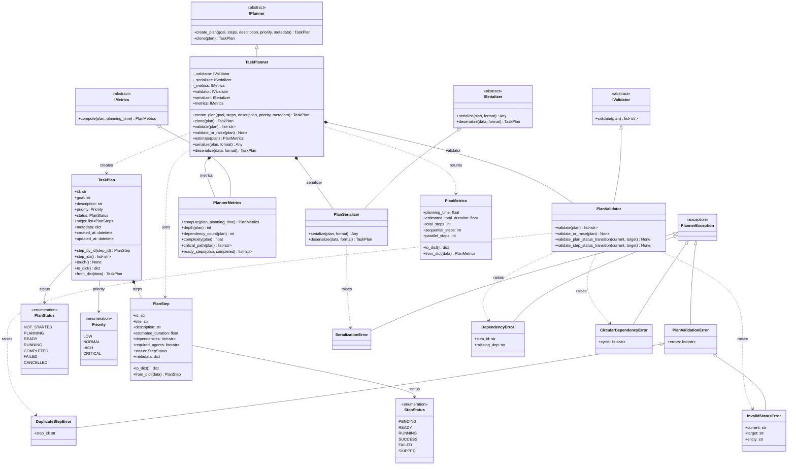
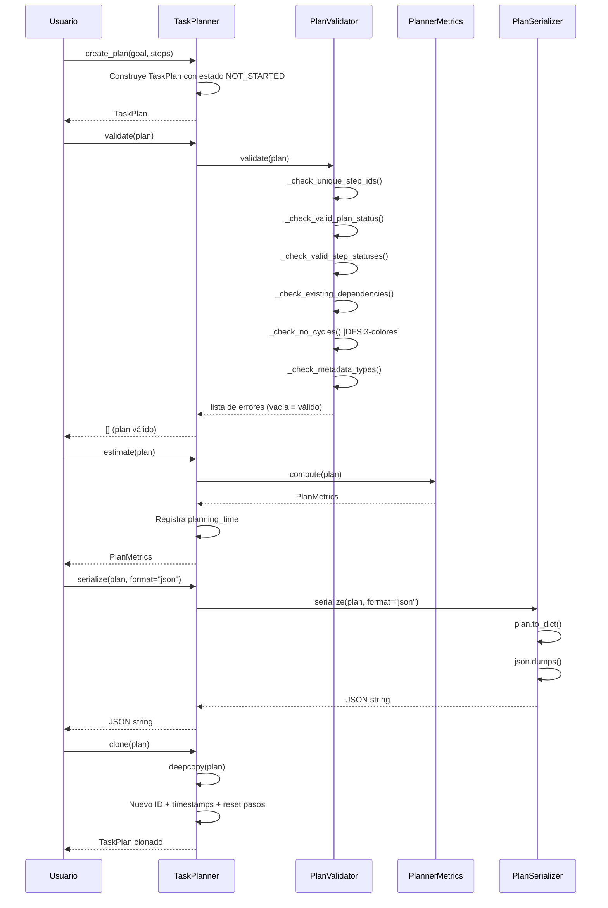
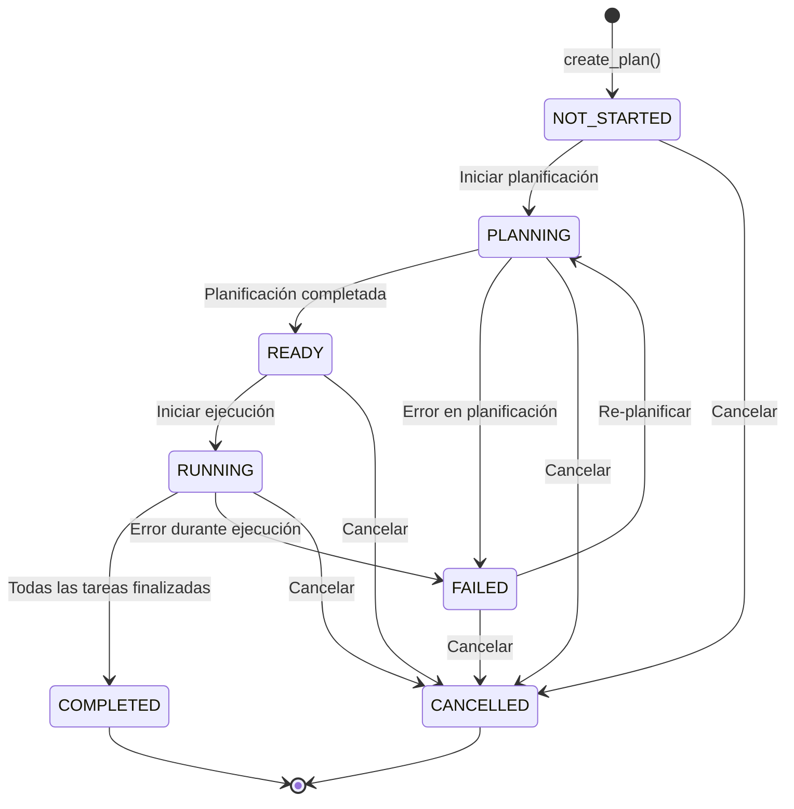
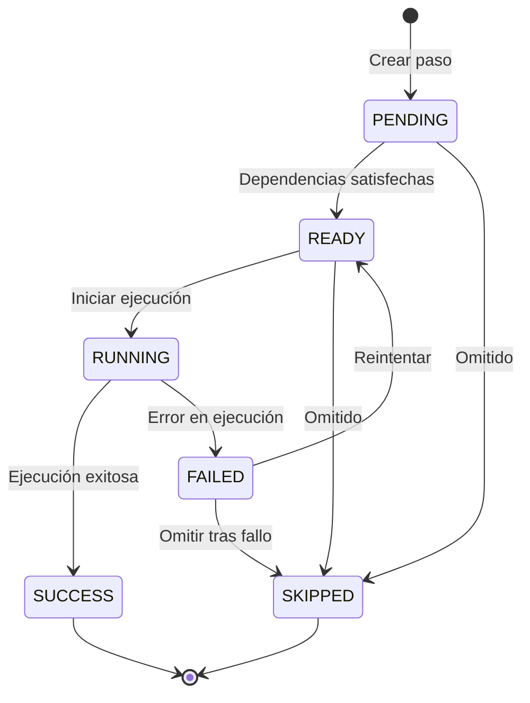
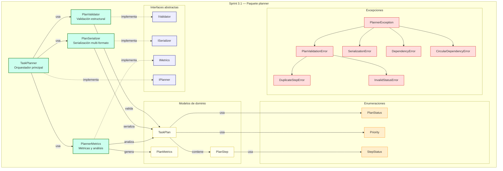

# Sprint 3.1 — Motor Inteligente de Planificación de Tareas (Planner)

> **Estado:** ✅ Completo · **Rama:** `sprint-3.1-planner`
> **Tests:** 168 pasando (nuevos Sprint 3.1) · **Compat:** ✅

## Resumen

Introduce el paquete `planner` como motor estructural de planificación de tareas.
El planner **crea, valida, serializa y analiza** planes de ejecución sin ejecutar
ninguna tarea real — manteniendo la arquitectura limpia y extensible para futura
planificación impulsada por IA (Sprint 3.2+).

Incluye:

- **Modelos de dominio** (`TaskPlan`, `PlanStep`, `PlanMetrics`) con serialización
  `to_dict`/`from_dict` consistente con las convenciones del proyecto.
- **Enumeraciones con máquina de estados** (`PlanStatus`, `StepStatus`, `Priority`)
  con transiciones validadas y funciones auxiliares `can_transition_*`.
- **Validación estructural completa** (`PlanValidator`): IDs únicos, dependencias
  existentes, detección de ciclos (DFS 3-colores), tipos de metadata, transiciones
  de estado.
- **Serialización multi-formato** (`PlanSerializer`): `dict`, `json`, `yaml`.
- **Métricas estructurales** (`PlannerMetrics`): pasos totales, secuenciales,
  paralelos, profundidad del grafo, ruta crítica, complejidad heurística.
- **Orquestador principal** (`TaskPlanner`): composición sobre herencia, con
  componentes inyectables que implementan interfaces `I*` abstractas.
- **Jerarquía de excepciones** específica del planner.

## Diagrama de clases



## Flujo de creación de un plan



## Máquina de estados: PlanStatus



## Máquina de estados: StepStatus



## Diagrama de componentes



## Estructura del paquete

```
packages/planner/
├── __init__.py          # API pública (re-exporta todo desde __all__)
├── planner.py           # TaskPlanner — orquestador principal
├── models.py            # TaskPlan, PlanStep, PlanMetrics (dataclasses)
├── enums.py             # PlanStatus, StepStatus, Priority + transiciones
├── validator.py         # PlanValidator — validación estructural
├── serializer.py        # PlanSerializer — dict/json/yaml
├── metrics.py           # PlannerMetrics — análisis del grafo
├── interfaces.py        # IPlanner, IValidator, ISerializer, IMetrics
└── exceptions.py        # PlannerException y jerarquía

tests/unit/
├── test_planner.py              # Tests del planner original (Sprint 1.7, 12 tests)
└── test_planner_v31.py          # Tests completos Sprint 3.1 (168 tests)
```

## Descripción detallada de cada módulo

### `enums.py` — Enumeraciones y máquina de estados

Define los tres enums fundamentales del paquete y las funciones de validación
de transiciones.

**`PlanStatus`** — Ciclo de vida de un plan:

| Estado | Valor | Descripción |
|---|---|---|
| `NOT_STARTED` | `not_started` | Plan creado, sin comenzar |
| `PLANNING` | `planning` | En proceso de planificación |
| `READY` | `ready` | Planificado, listo para ejecutar |
| `RUNNING` | `running` | En ejecución |
| `COMPLETED` | `completed` | Finalizado con éxito |
| `FAILED` | `failed` | Fallido (puede re-planificar) |
| `CANCELLED` | `cancelled` | Cancelado (terminal) |

**`StepStatus`** — Ciclo de vida de un paso individual:

| Estado | Valor | Descripción |
|---|---|---|
| `PENDING` | `pending` | Esperando dependencias |
| `READY` | `ready` | Dependencias satisfechas |
| `RUNNING` | `running` | En ejecución |
| `SUCCESS` | `success` | Completado con éxito |
| `FAILED` | `failed` | Fallido (puede reintentar) |
| `SKIPPED` | `skipped` | Omitido (terminal) |

**`Priority`** — Niveles de prioridad: `LOW` < `NORMAL` < `HIGH` < `CRITICAL`.

**Funciones de transición:**

- `can_transition_plan(current, target) -> bool` — Valida si la transición de
  estado del plan está permitida según el mapa `_ALLOWED_PLAN_TRANSITIONS`.
- `can_transition_step(current, target) -> bool` — Ídem para pasos.

### `models.py` — Modelos de dominio

Tres `@dataclass` con serialización manual `to_dict`/`from_dict`, consistente
con la convención existente del proyecto.

**`PlanStep`** — Un paso individual dentro de un `TaskPlan`:

```python
step = PlanStep(
    title="Ejecutar tests",
    description="Correr pytest en el módulo core",
    estimated_duration=30.0,
    dependencies=["step_build_id"],
    required_agents=["coder"],
    metadata={"retry_count": 2},
)
```

Campos: `id` (auto UUID), `title`, `description`, `estimated_duration` (segundos),
`dependencies` (IDs de pasos previos), `required_agents`, `status`, `metadata`.

**`TaskPlan`** — Plan de ejecución de nivel superior:

```python
plan = TaskPlan(
    goal="Desplegar a producción",
    description="Pipeline completo de CI/CD",
    priority=Priority.HIGH,
    status=PlanStatus.NOT_STARTED,
    steps=[step_build, step_test, step_deploy],
)
```

Métodos de conveniencia: `step_by_id()`, `step_ids()`, `touch()`.
Los timestamps `created_at`/`updated_at` se generan automáticamente en UTC.

**`PlanMetrics`** — Métricas computadas:

Campos: `planning_time`, `estimated_total_duration`, `total_steps`,
`sequential_steps`, `parallel_steps`.

### `exceptions.py` — Jerarquía de excepciones

```
PlannerException (base)
├── PlanValidationError
│   ├── DuplicateStepError      (step_id)
│   └── InvalidStatusError      (current, target, entity)
├── SerializationError
├── DependencyError             (step_id, missing_dep)
└── CircularDependencyError     (cycle: list[str])
```

Todas las excepciones son subclases de `PlannerException`, permitiendo captura
amplia (`except PlannerException`) o específica.

### `interfaces.py` — Contratos abstractos (ABC)

Cuatro interfaces con `abc.ABC` / `abc.abstractmethod`:

| Interfaz | Método(s) | Responsabilidad |
|---|---|---|
| `IPlanner` | `create_plan()`, `clone()` | Crear y clonar planes |
| `IValidator` | `validate()` | Validar integridad estructural |
| `ISerializer` | `serialize()`, `deserialize()` | Conversión de formatos |
| `IMetrics` | `compute()` | Calcular métricas estructurales |

El uso de `ABC` (en lugar de `Protocol`) permite verificaciones `isinstance`
en tiempo de ejecución.

### `validator.py` — Validación estructural

`PlanValidator(IValidator)` ejecuta seis comprobaciones secuenciales:

| Comprobación | Método | Qué detecta |
|---|---|---|
| IDs únicos | `_check_unique_step_ids()` | Pasos con ID duplicado |
| Estado de plan válido | `_check_valid_plan_status()` | Estado que no es `PlanStatus` |
| Estados de paso válidos | `_check_valid_step_statuses()` | Pasos con estado inválido |
| Dependencias existentes | `_check_existing_dependencies()` | Refs a pasos inexistentes |
| Sin ciclos | `_check_no_cycles()` | Ciclos en grafo de dependencias (DFS 3-colores) |
| Tipos de metadata | `_check_metadata_types()` | Valores no serializables JSON |

**`validate_or_raise()`** lanza excepciones específicas (`DuplicateStepError`,
`DependencyError`, `CircularDependencyError`) en lugar de retornar strings.

**Validación de transiciones:**

- `validate_plan_status_transition(current, target)` — Lanza `InvalidStatusError`.
- `validate_step_status_transition(current, target)` — Lanza `InvalidStatusError`.

### `serializer.py` — Serialización multi-formato

`PlanSerializer(ISerializer)` soporta tres backends:

| Formato | Serializar | Deserializar | Dependencia |
|---|---|---|---|
| `dict` | `plan.to_dict()` | `TaskPlan.from_dict()` | Ninguna |
| `json` | `json.dumps(indent=2)` | `json.loads()` |stdlib|
| `yaml` | `yaml.dump()` | `yaml.safe_load()` | PyYAML (opcional) |

Si PyYAML no está instalado, el formato `yaml` lanza `SerializationError`
con instrucciones de instalación claras.

Ejemplo:

```python
serializer = PlanSerializer()

# Dict (por defecto)
data = serializer.serialize(plan)  # → dict

# JSON
json_str = serializer.serialize(plan, format="json")
plan = serializer.deserialize(json_str, format="json")

# YAML (requiere pip install pyyaml)
yaml_str = serializer.serialize(plan, format="yaml")
plan = serializer.deserialize(yaml_str, format="yaml")
```

### `metrics.py` — Métricas y análisis del grafo

`PlannerMetrics(IMetrics)` calcula métricas puramente estructurales (sin datos
de ejecución en runtime).

**Método principal — `compute()`:**

Retorna `PlanMetrics` con: `total_steps`, `estimated_total_duration`,
`sequential_steps` (con dependencias), `parallel_steps` (sin dependencias).

**Métodos de análisis avanzado:**

| Método | Retorno | Algoritmo |
|---|---|---|
| `depth(plan)` | `int` | Camino más largo en el grafo de dependencias (memoización) |
| `dependency_count(plan)` | `int` | Total de aristas en el grafo |
| `complexity(plan)` | `float` (0.0–1.0+) | Combinación heurística: densidad (0.4) + profundidad (0.3) + log pasos (0.3) |
| `critical_path(plan)` | `list[str]` | Camino de mayor duración (topológico + backtracking) |
| `ready_steps(plan, completed)` | `list[str]` | Pasos cuyas dependencias están todas completadas |

### `planner.py` — Orquestador principal

`TaskPlanner(IPlanner)` es el punto de entrada público del paquete. Sigue un
diseño de **composición sobre herencia**: cada capacidad la proporciona un
componente inyectable.

```python
# Uso estándar con componentes por defecto
planner = TaskPlanner()
plan = planner.create_plan(
    goal="Desplegar a producción",
    steps=[
        PlanStep(title="Build", estimated_duration=60.0),
        PlanStep(title="Tests", dependencies=["<build_id>"], estimated_duration=120.0),
        PlanStep(title="Deploy", dependencies=["<test_id>"], estimated_duration=30.0),
    ],
)
planner.validate_or_raise(plan)
metrics = planner.estimate(plan)
json_blob = planner.serialize(plan, format="json")

# Clonar un plan (nuevo ID, timestamps frescos, pasos reseteados)
clon = planner.clone(plan)

# Inyección de dependencias (para testing o extensibilidad)
planner_custom = TaskPlanner(
    validator=MyCustomValidator(),
    serializer=MyCustomSerializer(),
    metrics=MyCustomMetrics(),
)
```

**Propiedades:** `validator`, `serializer`, `metrics` — permiten acceder a los
componentes internos para uso directo si se necesita.

## Referencia rápida de la API pública

```python
from planner import (
    # Modelos
    TaskPlan,
    PlanStep,
    PlanMetrics,
    # Enums
    PlanStatus,
    StepStatus,
    Priority,
    can_transition_plan,
    can_transition_step,
    # Excepciones
    PlannerException,
    PlanValidationError,
    SerializationError,
    DependencyError,
    CircularDependencyError,
    DuplicateStepError,
    InvalidStatusError,
    # Interfaces
    IPlanner,
    IValidator,
    ISerializer,
    IMetrics,
    # Implementaciones
    TaskPlanner,
    PlanValidator,
    PlanSerializer,
    PlannerMetrics,
)
```

## Cobertura de tests

| Archivo | Tests | Descripción |
|---|---|---|
| `tests/unit/test_planner_v31.py` | 168 | Tests completos Sprint 3.1 |

**Distribución por clase de test:**

| Clase de test | Área cubierta |
|---|---|
| `TestPlanStatus` | Transiciones de estado del plan |
| `TestStepStatus` | Transiciones de estado de pasos |
| `TestPriority` | Valores de enumeración de prioridad |
| `TestPlanStep` | Modelo `PlanStep`, `to_dict`/`from_dict` |
| `TestTaskPlan` | Modelo `TaskPlan`, búsqueda, serialización |
| `TestPlanMetrics` | Modelo `PlanMetrics`, serialización |
| `TestExceptions` | Jerarquía, atributos, mensajes |
| `TestInterfaces` | Verificación de clases abstractas |
| `TestPlanValidator` | 6 comprobaciones, `validate_or_raise`, transiciones |
| `TestPlanSerializer` | dict/json/yaml, errores, edge cases |
| `TestPlannerMetrics` | `compute`, `depth`, `complexity`, `critical_path`, `ready_steps` |
| `TestTaskPlanner` | `create_plan`, `clone`, `validate`, `estimate`, `serialize` |
| `TestYamlIntegration` | Integración con PyYAML (opcional) |
| `TestEdgeCases` | Casos límite y escenarios de borde |

**Total: 168 tests pasando en 0.36s.**

Los 12 tests del planner original (Sprint 1.7, `test_planner.py`) permanecen
compatibles sin cambios.

## Registro de cambios (Changelog)

### Nuevos archivos

| Archivo | Descripción |
|---|---|
| `packages/planner/__init__.py` | API pública con `__all__` explícito |
| `packages/planner/planner.py` | `TaskPlanner` — orquestador con composición |
| `packages/planner/models.py` | `TaskPlan`, `PlanStep`, `PlanMetrics` |
| `packages/planner/enums.py` | `PlanStatus`, `StepStatus`, `Priority` + transiciones |
| `packages/planner/validator.py` | `PlanValidator` — 6 comprobaciones + DFS anti-ciclos |
| `packages/planner/serializer.py` | `PlanSerializer` — dict/json/yaml |
| `packages/planner/metrics.py` | `PlannerMetrics` — análisis de grafo y complejidad |
| `packages/planner/interfaces.py` | `IPlanner`, `IValidator`, `ISerializer`, `IMetrics` |
| `packages/planner/exceptions.py` | 7 clases de excepción con jerarquía |
| `tests/unit/test_planner_v31.py` | 168 tests de cobertura completa |

### Decisiones de diseño

- **Composición sobre herencia**: `TaskPlanner` delega en componentes inyectables
  en lugar de heredar funcionalidad, facilitando testing y extensibilidad.
- **`dataclass` sobre Pydantic**: Los modelos internos usan `@dataclass` con
  serialización manual, coherente con las convenciones existentes del proyecto.
- **`ABC` sobre `Protocol`**: Las interfaces usan `abc.ABC` para permitir
  verificaciones `isinstance` en runtime.
- **`str, Enum`**: Todos los enums heredan de `str` y `Enum` para
  interoperabilidad directa con JSON.
- **Transiciones declarativas**: Los mapas `_ALLOWED_*_TRANSITIONS` definen
  la máquina de estados de forma declarativa y verificable.
- **Sin ejecución**: El planner **nunca** ejecuta tareas — solo construye y
  gestiona estructuras de planes, manteniendo el paquete desacoplado del motor
  de agentes.
- **YAML opcional**: PyYAML es una dependencia opcional; su ausencia produce
  un `SerializationError` con instrucciones claras.

### Compatibilidad

- Los 12 tests del Sprint 1.7 (`test_planner.py`) siguen pasando sin cambios.
- El paquete `planner` es independiente y no modifica ningún paquete existente.
- Toda la API es síncrona (sin async), alineado con la naturaleza estructural
  del planner (sin I/O).

## Roadmap

- **Sprint 3.2**: Integración del planner con el motor LLM para planificación
  inteligente (generación automática de pasos y dependencias).
- **Sprint 3.3**: Ejecutor de planes que consuma `TaskPlan` y coordine agentes
  del `AgentRegistry` (Sprint 2.3) para ejecutar cada `PlanStep`.
- **Sprint 3.4**: Persistencia de planes en SQLite con historial de ejecuciones.
- **Sprint 3.5**: Visualización de progreso del plan y adaptación dinámica
  (re-planificación ante fallos).